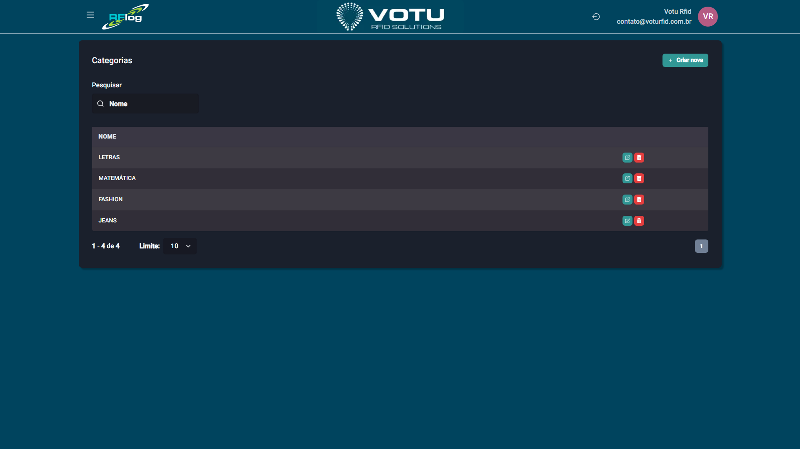

# Categorias

## O que e

A secao **Categorias** lista as categorias de produtos cadastradas no sistema. As categorias sao **sincronizadas com o ERP** (quando ha integracao) ou podem ser criadas manualmente.

## Captura de Tela

## Como Acessar

Menu lateral: **Produtos** > **Categoria**

## Funcionalidades

- **Pesquisar** — Busque categorias por nome
- **Criar nova** — Adicione uma nova categoria manualmente
- **Paginacao** — Navegue entre as categorias cadastradas (10, 50, 100, 200 por pagina)

## Como Criar uma Categoria

1. Clique em **"Criar nova"**
2. Preencha o nome da categoria
3. Salve

## Quando Usar

- Quando precisar classificar produtos por tipo
- Quando nao ha integracao com ERP e e preciso cadastrar categorias manualmente
- Para manter a organizacao do catalogo de produtos

## Notas

- Categorias, colecoes, grupos e linhas seguem a mesma logica de funcionamento
- Se ha integracao com ERP, as categorias sao puxadas automaticamente

## Veja Tambem

- [Produtos](Produtos.md) — Lista de produtos
- [Colecoes](Colecoes.md) — Classificacoes temporais
- [Grupos](Grupos.md) — Classificacoes por grupo
- [Linhas](Linhas.md) — Sub-classificacoes por linha

---

*Guia de Usuario RFLog — Votu RFID Solutions*
