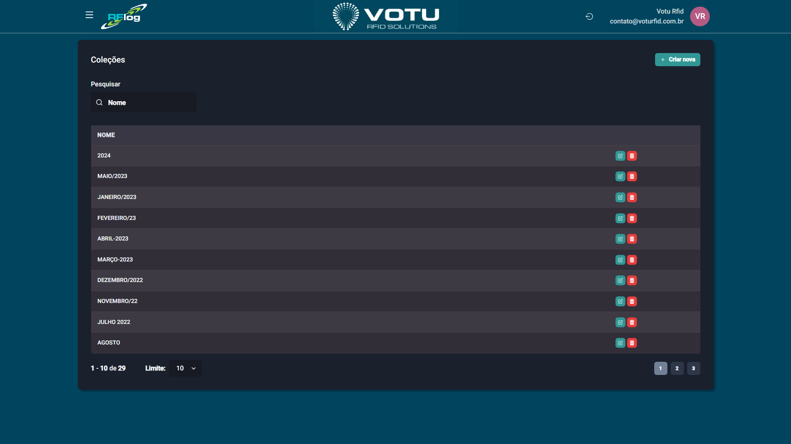

# Colecoes

## O que e

As **Colecoes** sao classificacoes temporais/sazonais de produtos (ex: "2024", "MAIO/2023", "JANEIRO/2023"). Sao sincronizadas com o ERP ou criadas manualmente.

## Captura de Tela

## Como Acessar

Menu lateral: **Produtos** > **Colecao**

## Funcionalidades

- **Pesquisar** — Busque colecoes por nome
- **Criar nova** — Adicione uma nova colecao manualmente
- **Paginacao** — Navegue entre as colecoes

## Quando Usar

- Para organizar produtos por temporada ou epoca
- Para filtrar relatorios e consultas por colecao

## Veja Tambem

- [Produtos](Produtos.md)
- [Categorias](Categorias.md)
- [Grupos](Grupos.md)
- [Linhas](Linhas.md)

---

*Guia de Usuario RFLog — Votu RFID Solutions*
