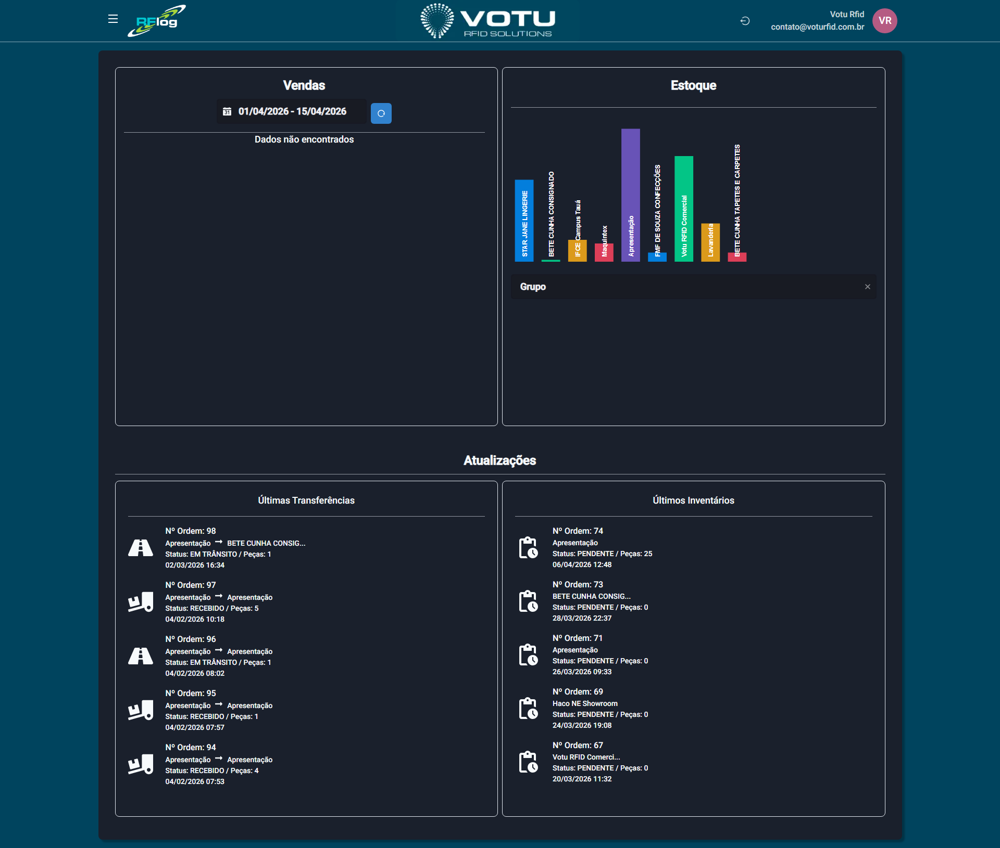

# Dashboard

## O que e o Dashboard

O Dashboard e a **pagina inicial** do RFLog. Ele oferece uma visao geral do negocio com metricas de vendas, distribuicao de estoque e atividades recentes.

## Captura de Tela

## O que o Dashboard Exibe

### Graficos

- **Grafico de Vendas** — Colunas mostrando o volume de vendas no periodo selecionado
- **Grafico de Estoque** — Dados de estoque distribuidos por grupo de produto

### Lista de Estabelecimentos

Lista os clientes/estabelecimentos cadastrados no sistema, permitindo visualizar rapidamente quem esta ativo na plataforma.

### Atualizacoes Recentes

#### Ultimas Transferencias

Mostra as transferencias mais recentes com:
- **Numero da Ordem**
- **Status** (EM TRANSITO ou RECEBIDO)
- **Quantidade de Pecas**
- **Data e Hora**

#### Ultimos Inventarios

Mostra os inventarios mais recentes com:
- **Numero da Ordem**
- **Status** (PENDENTE ou PROCESSADO)
- **Quantidade de Pecas**
- **Data e Hora**

## Filtros do Dashboard

- **Periodo** — Campo de data para filtrar os dados apresentados (ex: 01/04/2026 - 15/04/2026)
- **Filtro de Estoque** — Dropdown para filtrar por grupo de produto
- **Filtros adicionais** — Quando disponiveis: Linha, Grupo, Colecao e Categoria (dependendo do cadastro do produto)

## Como Usar

1. Ao fazer login, voce ja cai no Dashboard
2. Use o **filtro de periodo** para ajustar a janela de tempo dos dados
3. Use o **filtro de estoque** para ver dados por grupo especifico
4. Clique em uma transferencia ou inventario recente para ver detalhes
5. Use o menu lateral para navegar para outras secoes

## Dicas

- O dashboard e um bom ponto de partida para entender a situacao atual do negocio
- Use os filtros para refinar a visao conforme sua necessidade
- As atualizacoes recentes ajudam a acompanhar o fluxo de operacoes

## Veja Tambem

- [02 Navegacao](../02_Navegacao.md) — Como navegar pelo sistema
- [Transferencias Movimentacao](Transferencias_Movimentacao.md) — Ver transferencias em detalhe
- [Inventarios](Inventarios.md) — Ver inventarios em detalhe
- [Estoque](Estoque.md) — Consulta completa de estoque

---

*Guia de Usuario RFLog — Votu RFID Solutions*
