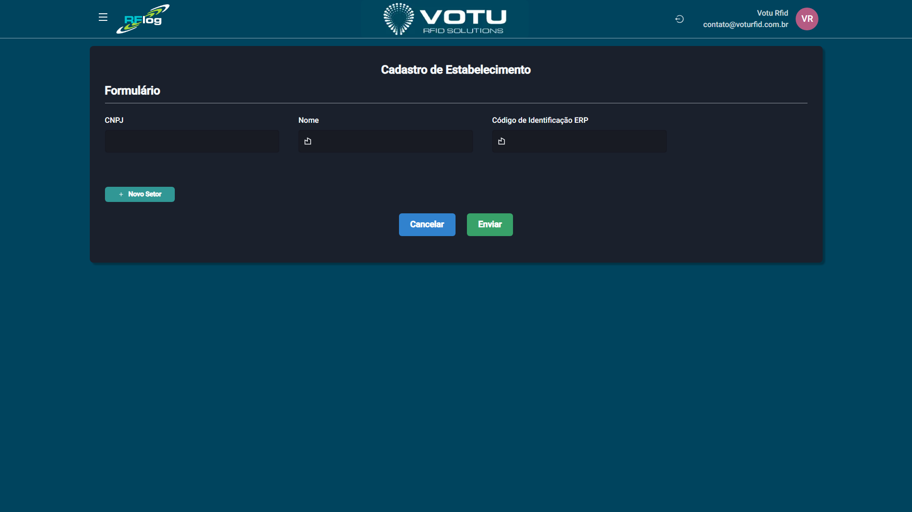

# Estabelecimentos - Cadastro

## O que e

A secao **Estabelecimentos - Cadastro** permite criar novos estabelecimentos com seus setores vinculados.

## Captura de Tela

## Como Acessar

Menu lateral: **Estabelecimentos** > **Cadastro**

## O que Voce Ve

A pagina exibe um formulario com os seguintes campos:

- **CNPJ**
- **Nome**
- **Codigo de Identificacao ERP**
- **Secao "Novo Setor"** (para adicionar setores ao estabelecimento)
- Botoes: **Cancelar**, **Enviar**

## Funcionalidade

Formulario de criacao de novo estabelecimento com seus setores vinculados. Permite inserir o CNPJ, nome, codigo ERP e adicionar um ou mais setores ao estabelecimento.

## Dicas

- Preencha corretamente o CNPJ e o codigo de identificacao ERP para garantir a integracao com o ERP
- Utilize a secao "Novo Setor" para adicionar setores ao estabelecimento (ex: LOJA, DEPOSITO, CONSIGNADO 1, etc.)
- Após o cadastro, o estabelec aparecera na lista de estabelecimentos para consulta e edicao

## Veja Tambem

- [Estabelecimentos Lista](Estabelecimentos_Lista.md) — Lista de estabelecimentos cadastrados
- [Sincronia ERP](Sincronia_ERP.md) — Sincronizacao de dados com o ERP
- [Usuarios Lista](Usuarios_Lista.md) — Gestao de usuarios do sistema

---
*Guia de Usuario RFLog — Votu RFID Solutions*