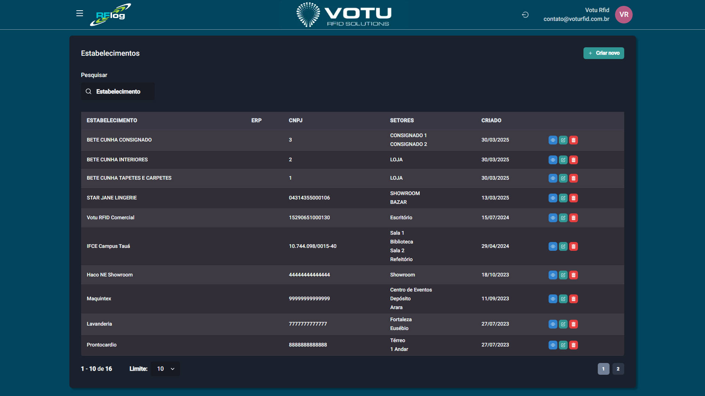

# Estabelecimentos - Lista

## O que e

A secao **Estabelecimentos** permite visualizar e gerenciar os estabelecimentos (lojas, depositos, etc.) cadastrados no sistema, incluindo seus setores e integracao com o ERP.

## Captura de Tela

## Como Acessar

Menu lateral: **Estabelecimentos** > **Lista**

## O que Voce Ve

A pagina exibe uma tabela com os estabelecimentos cadastrados:

| Coluna | Descricao |
|---|---|
| **ESTABELECIMENTO** | Nome do estabelecimento |
| **ERP** | Codigo de identificacao no ERP |
| **CNPJ** | CNPJ do estabelecimento |
| **SETORES** | Setores associados (ex: CONSIGNADO 1, CONSIGNADO 2, LOJA) |
| **CRIADO** | Data de criacao do registro |

Além disso, há:
- Botao **"Criar novo"** para adicionar um novo estabelecimento
- Campo de busca **"Pesquisar"** para filtrar por nome, CNPJ ou outros criterios

## Funcionalidade

Gestao de estabelecimentos (lojas, depositos, etc.) com seus setores e integracao ERP. Permite visualizar, criar, editar e excluir estabelecimentos, bem como gerenciar seus setores associados.

## Dicas

- Use o campo de busca para localizar rapidamente um estabelecimento especifico
- Ao criar ou editar um estabelecimento, certifique-se de preencher corretamente o CNPJ e o codigo de identificacao ERP
- Os setores podem ser adicionados posteriormente através da tela de cadastro do estabelecimento

## Veja Tambem

- [Estabelecimentos Cadastro](Estabelecimentos_Cadastro.md) — Formulario de criacao/edicao de estabelecimentos
- [Usuarios Lista](Usuarios_Lista.md) — Gestao de usuarios do sistema
- [Sincronia ERP](Sincronia_ERP.md) — Sincronizacao de dados com o ERP

---
*Guia de Usuario RFLog — Votu RFID Solutions*