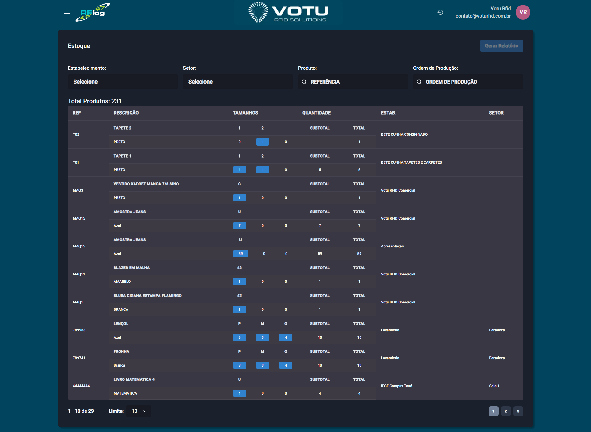

# Estoque

## O que e

A secao **Estoque** mostra todos os produtos que estao em algum estabelecimento e setor naquela instancia do RFLog. E a consulta principal para saber onde estao os produtos.

## Captura de Tela

## Como Acessar

Menu lateral: **Estoque**

## Filtros Disponiveis

| Filtro | Descricao |
|---|---|
| **Estabelecimento** | Filtra por local |
| **Setor** | Filtra por setor |
| **Produto** | Filtra por referencia |
| **Ordem de Producao** | Filtra por OP |

Use o botao **"Gerar Relatorio"** para exportar um relatorio de estoque com os dados filtrados.

## Tabela de Estoque

A tabela mostra **Total Produtos** e as seguintes colunas:

| Coluna | Descricao |
|---|---|
| **Referencia** | Codigo de referencia |
| **Descricao** | Descricao do produto (agrupamento principal) |
| **Tamanhos** | Tamanhos disponiveis |
| **Quantidade** | Dividida em **subtotal** (por cor) e **total** (soma de todos) |
| **Estabelecimento** | Local onde esta |
| **Setor** | Setor do local |

### Agrupamento

- Os produtos sao agrupados por **Descricao** — se houver varias cores para a mesma referencia, elas aparecem abaixo
- A **Quantidade** tem duas divisoes:
  - **Subtotal** — Total de produtos de diferentes tamanhos de uma cor
  - **Total** — Soma de todos os subtotais daquela referencia

## Acesso a Linha do Tempo

Clique em qualquer **quantidade** na grade para abrir um modal com a **[Linha do Tempo](Linha_do_Tempo.md)** dos EPCs em questao.

## Dicas

- Use os filtros para refinar a busca ao estoque
- O agrupamento por descricao facilita visualizar cores e tamanhos de um mesmo produto
- O relatorio de estoque pode ser gerado com base nos filtros aplicados

## Veja Tambem

- [Linha do Tempo](Linha_do_Tempo.md) — Rastreabilidade de EPCs
- [Inventarios](Inventarios.md) — Contagem de estoque
- [Relatorio Permanencia](Relatorio_Permanencia.md) — Produtos parados ha muito tempo
- [Estabelecimentos Lista](Estabelecimentos_Lista.md) — Lista de estabelecimentos

---

*Guia de Usuario RFLog — Votu RFID Solutions*
