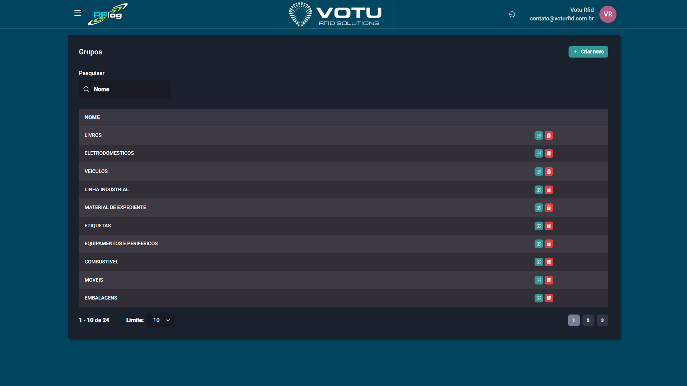

# Grupos

## O que e

Os **Grupos** sao classificacoes amplas de produtos (ex: "ELETRODOMESTICOS", "VEICULOS", "MOVEIS"). Sao sincronizados com o ERP ou criados manualmente.

## Captura de Tela

## Como Acessar

Menu lateral: **Produtos** > **Grupo**

## Funcionalidades

- **Pesquisar** — Busque grupos por nome
- **Criar novo** — Adicione um novo grupo manualmente
- **Paginacao** — Navegue entre os grupos

## Quando Usar

- Para classificar produtos em macro-categorias
- Como filtro em relatorios e consultas
- Para organizar o catalogo de produtos

## Veja Tambem

- [Produtos](Produtos.md)
- [Categorias](Categorias.md)
- [Colecoes](Colecoes.md)
- [Linhas](Linhas.md)

---

*Guia de Usuario RFLog — Votu RFID Solutions*
