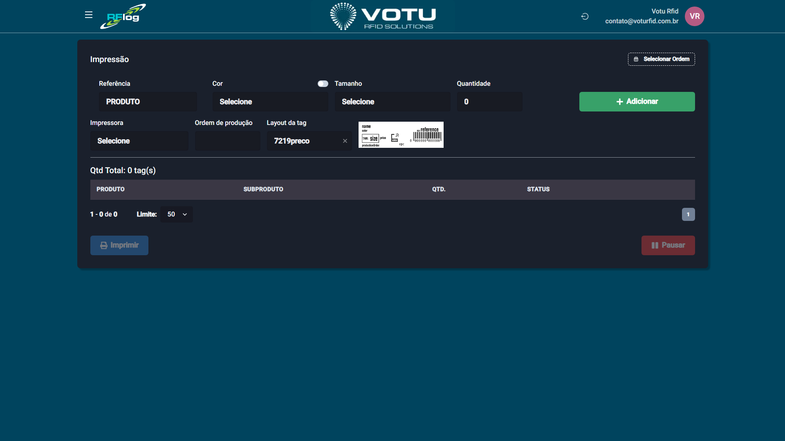

# Impressao — Impressao Avulsa

## O que e

A **Impressao Avulsa** permite imprimir etiquetas RFID preenchendo manualmente referencia, cor, tamanho e quantidade. E ideal para impressoes pontuais ou de pequenos lotes.

## Como Acessar

Menu lateral: **Impressao** > **Imprimir**

## Captura de Tela

## Como Imprimir uma Etiqueta

### Passo 1: Adicionar Produtos a Fila

1. No campo **Referencia**, digite ou selecione a referencia do produto
2. Preencha os campos **Cor**, **Tamanho** e **Quantidade**
3. Clique em **"Adicionar"** para incluir na fila de impressao

> **Dica:** Por padrao, a referencia e mantida no campo apos adicionar. Para manter tambem a **cor** selecionada, use o botao **toggle** acima do campo Cor. Isso facilita quando voce vai adicionar varios subprodutos da mesma referencia e cor.

### Passo 2: Configurar a Impressao

1. Selecione o **Layout da tag** (preconfigurado no sistema)
2. Opcionalmente, preencha a **Ordem de producao** (atrelada ao cadastro da etiqueta para filtros futuros)
3. Selecione a **Impressora** (cadastrada pelo time Votu)

### Passo 3: Imprimir

1. Clique em **"Imprimir"** para iniciar a impressao
2. Durante a impressao, voce pode **"Pausar"** o processo
3. Acompanhe o progresso na tabela de status

## Funcionalidades Avançadas

### Selecionar Ordem Existente

No topo da pagina, use o botao **"Selecionar Ordem"** para carregar uma [Impressao Ordens](Impressao_Ordens.md) ja criada e imprimir diretamente, sem precisar preencher a fila manualmente.

### Invalidar Tags

Se houve um erro de impressao, voce pode **invalidar tags** ja impressas:
1. Na fila de impressao (quando uma ordem esta em andamento), localize o produto
2. Clique no botao laranja de **invalidar** (ao lado do botao de deletar)
3. Um modal abrira para selecionar os EPCs a serem invalidados
4. A fila sera ajustada automaticamente — os EPCs invalidados voltam a fila para reimpressao

> **Atencao:** A invalidacao remove EPCs do banco de dados. E uma operacao sensivel, mas necessaria em caso de impressoes incorretas.

### Excluir Produtos da Fila

Antes de iniciar a impressao, voce pode excluir produtos individuais da fila usando o botao de deletar em cada linha.

## Tabela de Impressao

A tabela na parte inferior mostra os produtos na fila:

| Coluna | Descricao |
|---|---|
| **Produto** | Referencia/nome do produto |
| **Subproduto** | Cor e tamanho |
| **Qtd.** | Quantidade de etiquetas |
| **Status** | Status da impressao (aguardando, imprimindo, concluido) |

## Dicas

- Use o toggle para manter a cor selecionada e agilizar a insercao de varios subprodutos
- A Ordem de Producao ajuda em filtros futuros em outras telas
- Se precisar de controle mais rigoroso sobre as impressoes, use as [Impressao Ordens](Impressao_Ordens.md)

## Veja Tambem

- [Impressao Ordens](Impressao_Ordens.md) — Criar ordens de impressao para controle
- [Produtos](Produtos.md) — Consultar produtos para impressao
- [Transferencias Movimentacao](Transferencias_Movimentacao.md) — Filtrar por Ordem de Producao

---

*Guia de Usuario RFLog — Votu RFID Solutions*
