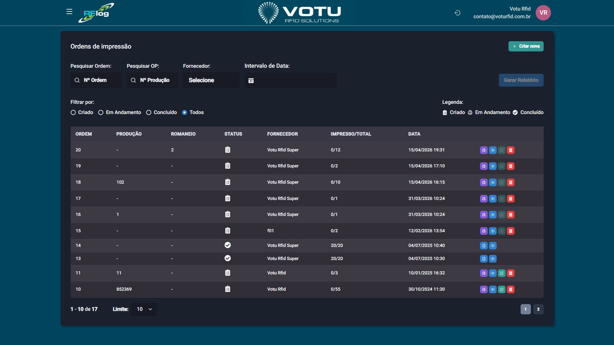

# Impressao — Ordens

## O que e

As **Ordens de Impressao** permitem controlar e gerenciar lotes de impressao de etiquetas RFID. Diferente da [Impressao Imprimir](Impressao_Imprimir.md) (avulsa), as ordens oferecem rastreabilidade e controle sobre o que foi impresso, quando e por quem.

## Captura de Tela

## Como Acessar

Menu lateral: **Impressao** > **Ordens**

## Criar uma Nova Ordem

1. Clique em **"Criar nova"** (canto superior direito)
2. Preencha os dados da ordem (semelhante a impressao avulsa)
3. Adicione produtos a fila de impressao
4. **Importar produtos:** Clique no botao **"Importar produtos"** (canto superior direito) para carregar uma fila de impressao via arquivo. O formato padrao e `codigo_barras;quantidade` (pode variar por cliente)
5. Escolha uma opcao:
   - **Salvar** — Salva a ordem para imprimir depois
   - **Salvar e Imprimir** — Salva e direciona para a tela de impressao

## Filtros Disponiveis

| Filtro | Descricao |
|---|---|
| **Pesquisar Ordem** | Busca por numero de ordem |
| **Pesquisar OP** | Busca por ordem de producao |
| **Fornecedor** | Filtra por fornecedor (tipo de usuario) |
| **Intervalo de Data** | Filtra por periodo |
| **Status** | Criado, Em Andamento, Concluido, Todos |

## Botoes de Acao por Status

### Criado (ordens aguardando impressao)

| Botao | Cor | Funcao |
|---|---|---|
| **Criar impressao** | Roxo | Abre a tela de impressao com a fila daquela ordem. Permite alterar layout da tag e selecionar impressora |
| **Visualizar** | Azul | Mostra os produtos na fila de impressao |
| **Editar** | Verde | Permite editar a fila — adicionar ou remover produtos |
| **Deletar** | Vermelho | Deleta a ordem de impressao |

### Em Andamento (impressao em curso)

| Botao | Cor | Funcao |
|---|---|---|
| **Relatorio de impressao** | Azul | Emite relatorio com dados da ordem. Permite selecionar graficos por Grupo, Linha, Categoria. Opcoes: "geral" ou "por ordem de impressao" |
| **Visualizar** | Azul | Mostra os produtos na fila |

### Concluido (impressao finalizada)

| Botao | Cor | Funcao |
|---|---|---|
| **Relatorio de impressao** | Azul | Emite relatorio da ordem (mesma funcao) |
| **Visualizar** | Azul | Mostra os produtos na fila |

## Gerar Relatorio

Na tela principal de ordens, use o botao **"Gerar Relatorio"** para emitir um relatorio com base nos filtros aplicados. O relatorio abre em uma nova guia pronto para **Ctrl+P** (imprimir ou salvar em PDF).

## Dicas

- Use ordens de impressao quando precisar de controle e rastreabilidade das etiquetas impressas
- O fornecedor pode criar ordens de impressao para que outro usuario imprima
- As ordens podem ser expandidas na propria lista, mostrando botoes internos sem voltar a tela principal
- O arquivo de importacao usa o formato `codigo_barras;quantidade`

## Veja Tambem

- [Impressao Imprimir](Impressao_Imprimir.md) — Impressao avulsa
- [Produtos](Produtos.md) — Consultar produtos
- [Tipos Usuarios](Tipos_Usuarios.md) — Perfis de usuario (Fornecedor pode criar ordens)

---

*Guia de Usuario RFLog — Votu RFID Solutions*
