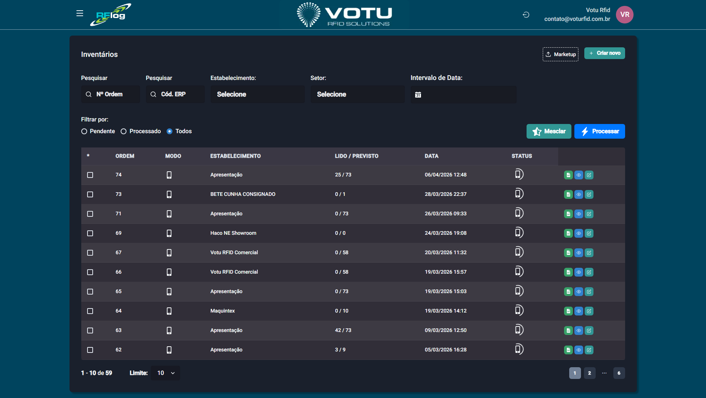

# Inventarios

## O que e

A secao **Inventarios** agrupa todos os inventarios realizados no sistema. O inventario e o processo de **contagem de produtos no estoque** usando leitura RFID, permitindo comparar o fisico com o sistema.

## Captura de Tela

## Como e Feito o Inventario

Os inventarios podem ser realizados de duas formas:
1. **RFLog Mobile** — Aplicativo que se comunica com leitor movel via Bluetooth (forma mais comum)
2. **Web (Cabine de leitura)** — Criacao e captura direto pelo navegador usando a cabine de leitura RFID

## Como Acessar

Menu lateral: **Inventarios** > **Lista**

## Lista de Inventarios

A tela principal mostra todos os inventarios com opcoes de filtro e acoes.

### Filtros Disponiveis

| Filtro | Descricao |
|---|---|
| **Numero de Ordem** | Cada inventario tem seu proprio numero |
| **Codigo ERP** | Codigo devolvido pelo ERP quando o inventario e sincronizado |
| **Estabelecimento** | Filtra por estabelecimento |
| **Setor** | Filtra por setor |
| **Intervalo de Data** | Filtra por periodo |
| **Status** | Pendente, Processado, Todos |

### Acoes em Destaque

- **Mesclar** — Selecione dois ou mais inventarios e junte-os. Um EPC nunca se repete — se estiver duplicado entre inventarios, e contabilizado apenas uma vez. Isso facilita a releitura no processo de inventario.
- **Processar** — Finaliza o inventario. Se ha integracao com ERP, envia os dados ao ERP e atualiza o estoque. Se nao, apenas atualiza o RFLog.

### Botoes de Acao por Status

#### Inventarios Nao Processados (Pendente)

| Botao | Cor | Funcao |
|---|---|---|
| **Inventario.txt** | Verde | Exporta arquivo .txt com `codigo_barras,quantidade`. Pode usar codigos "stackados" (repeticao = quantidade) |
| **Visualizar** | Azul | Abre visualizacao detalhada — mostra lido vs esperado |
| **Editar** | Verde | Edita manualmente, removendo EPCs lidos indevidamente |
| **Deletar** | Vermelho | Deleta o registro de inventario |
| **Desfazer juncao** | Verde | Desfaz a ultima mesclagem. Nao e possivel desfazer mais de uma mesclagem empilhada |

#### Inventarios Processados

| Botao | Cor | Funcao |
|---|---|---|
| **Inventario.txt** | Verde | Exporta arquivo .txt (mesma funcao) |
| **Visualizar** | Azul | Abre visualizacao (mesma funcao) |
| **Deletar** | Vermelho | Deleta o registro |
| **Enviar novamente** | Laranja | Tenta reenviar ao ERP em caso de erro no envio anterior |

## Registrar Inventario (Web)

1. Menu lateral: **Inventarios** > **Registrar**
2. Selecione **Estabelecimento** e **Setor**
3. Selecione a **Zona de leitura** (cabine)
4. Inicie a leitura (5 segundos ou modo play/pause)
5. Acompanhe os produtos lidos na tabela
6. Ao finalizar, salve o inventario

> Os produtos lidos aparecem na tabela com REF, DESCRICAO, TAMANHOS e TOTAL. O contador mostra quantas tags foram **LIDAS**.

## Dicas

- A mesclagem facilita quando voce precisa fazer inventario em etapas
- O arquivo .txt exportado pode ser usado em ERPs ou para controle externo
- Se o inventario for sincronizado com ERP, o codigo devolvido serve para controle interno

## Veja Tambem

- [Inventarios](Inventarios.md#registrar-inventario) — Registrar inventario via web
- [Estoque](Estoque.md) — Consulta de estoque (resultado dos inventarios)
- [Transferencias Movimentacao](Transferencias_Movimentacao.md) — Outra operacao que movimenta estoque
- [Sincronia ERP](Sincronia_ERP.md) — Sincronizacao com ERP

---

*Guia de Usuario RFLog — Votu RFID Solutions*
