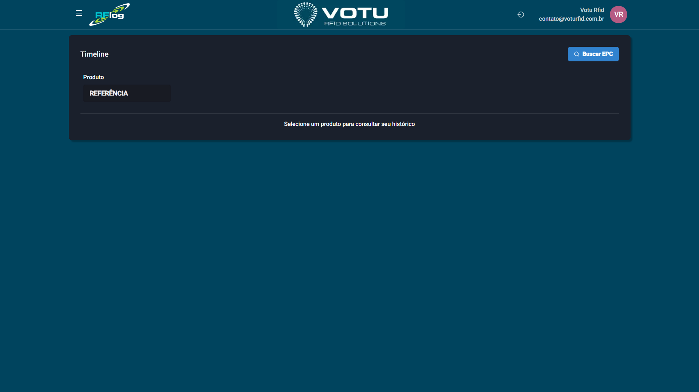

# Linha do Tempo

## O que e

A **Linha do Tempo** e a ferramenta de **rastreabilidade completa** do RFLog. Toda vez que uma etiqueta RFID e identificada pelo sistema — desde a impressao, passando por inventarios, transferencias, ate a venda — ela ganha um registro na linha do tempo.

## Captura de Tela

## Como Acessar

Menu lateral: **Produtos** > **Linha do Tempo**

## Como Usar

### Busca por EPC Direto

1. No campo **"Buscar EPC"**, digite o codigo EPC da etiqueta que deseja rastrear
2. Pressione Enter ou selecione o resultado
3. A linha do tempo daquele EPC sera exibida

### Busca por Produto

1. Clique no dropdown **"Produto"** e selecione "Selecione um produto para consultar seu historico"
2. Busque e selecione o produto desejado
3. Escolha o **subproduto** (cor e tamanho)
4. Um **modal** sera aberto com a lista de todos os EPCs para aquele produto (codigo de barras)
5. Clique em um EPC para expandir e ver sua linha do tempo completa

## O que a Linha do Tempo Mostra

A linha do tempo registra **todos os eventos** de um EPC, incluindo:
- **Impressao** — Quando a etiqueta foi impressa
- **Inventarios** — Quando foi lida em um inventario
- **Transferencias** — Quando foi movimentada entre estabelecimentos/setores
- **Vendas** — Quando foi vendida
- **Qualquer outra leitura** pelo sistema RFID

## Quando Usar

- Para rastrear onde esta um produto especifico
- Para investigar movimentacoes de uma etiqueta
- Para verificar o historico completo de um item
- Para auditorias e controle de qualidade

## Dicas

- O EPC e o identificador unico de cada etiqueta RFID
- Voce pode acessar a linha do tempo de qualquer tela onde clicar em uma **quantidade de produtos** na grade (ex: [Estoque](Estoque.md), [Inventarios](Inventarios.md), [Transferencias Entrada Saida](Transferencias_Entrada_Saida.md))
- A busca por EPC direto e mais rapida quando voce ja tem o codigo

## Veja Tambem

- [Produtos](Produtos.md) — Lista de produtos
- [Estoque](Estoque.md) — Consulta de estoque com acesso a linha do tempo
- [Inventarios](Inventarios.md) — Inventarios com acesso a linha do tempo

---

*Guia de Usuario RFLog — Votu RFID Solutions*
