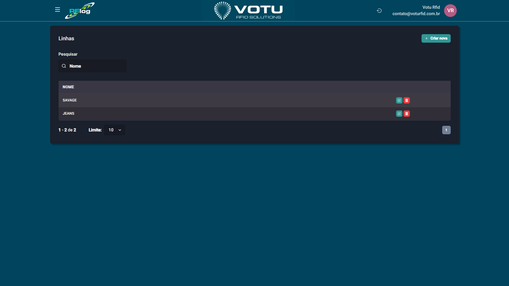

# Linhas

## O que e

As **Linhas** sao sub-classificacoes de produtos dentro de um grupo (ex: "SAVAGE", "JEANS"). Representam subdivisoes mais especificas dentro da hierarquia de produtos.

## Captura de Tela

## Como Acessar

Menu lateral: **Produtos** > **Linha**

## Funcionalidades

- **Pesquisar** — Busque linhas por nome
- **Criar nova** — Adicione uma nova linha manualmente
- **Paginacao** — Navegue entre as linhas

## Quando Usar

- Para refinar a classificacao de produtos dentro de um grupo
- Para organizacao mais detalhada do catalogo

## Veja Tambem

- [Produtos](Produtos.md)
- [Categorias](Categorias.md)
- [Colecoes](Colecoes.md)
- [Grupos](Grupos.md)

---

*Guia de Usuario RFLog — Votu RFID Solutions*
