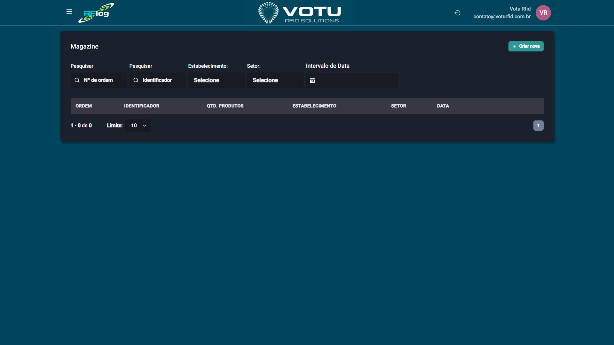

# Magazines — Lista

## O que e

A funcionalidade **Magazines** faz leitura de etiquetas RFID que **nao estao no banco de dados do RFLog**, mas estao no padrao **GTIN**. Ela extrai informacoes de codigo de barras diretamente do EPC, permitindo fazer conferencias sem confronto com estoque.

O nome vem do fato de que muitos clientes sao **fornecedores de grandes magazines** (lojas de departamento). Cada magazine pode ter sua propria etiqueta RFID com informacoes em bancos de dados privados.

## Captura de Tela

## Como Acessar

Menu lateral: **Magazines** > **Lista**

## Filtros Disponiveis

| Filtro | Descricao |
|---|---|
| **N Ordem** | Numero de controle gerado pelo RFLog |
| **Identificador** | Nome dado pelo usuario (ex: Havan1234, Zema5678) |
| **Estabelecimento** | Local da leitura |
| **Setor** | Setor do local |
| **Intervalo de Data** | Periodo |

## Tabela de Resultados

| Coluna | Descricao |
|---|---|
| **Ordem** | Numero da leitura |
| **Identificador** | Nome definido pelo usuario |
| **Qtd. Produtos** | Quantidade de itens lidos |
| **Estabelecimento** | Local |
| **Setor** | Setor |
| **Data** | Data e hora da leitura |

## Dicas

- O Magazine nao exige que o EPC esteja cadastrado no banco — extrai o GTIN diretamente
- Util para fornecedores que vendem para diferentes magazines
- A leitura funciona como uma conferencia pura, sem confronto

## Veja Tambem

- [Magazines Registrar](Magazines_Registrar.md) — Registrar nova leitura de magazine
- [Inventarios](Inventarios.md) — Similar, mas para contagem de estoque

---

*Guia de Usuario RFLog — Votu RFID Solutions*
