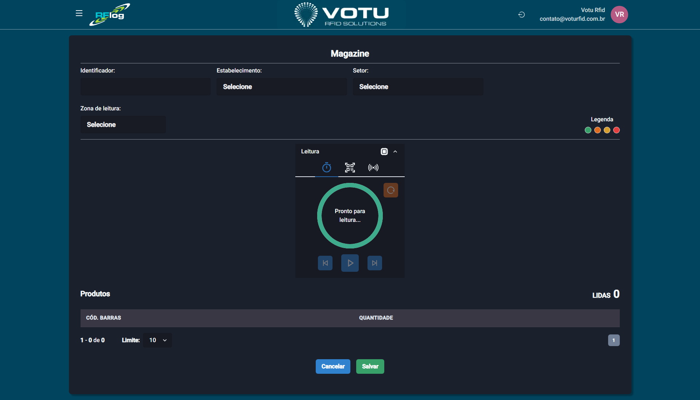

# Magazines — Registrar

## O que e

Registro de leitura de Magazine. O operador faz a captura de tags RFID e o sistema extrai os codigos de barras (GTIN) dos EPCs, exibindo-os na tela com quantidades.

## Captura de Tela

## Como Acessar

Menu lateral: **Magazines** > **Criar nova**

## Como Fazer a Leitura

### Passo 1: Preencher Dados

1. No campo **Identificador**, preencha um identificador para a sessao (ex: `Havan1234`, `Zema5678`)
2. Selecione o **Estabelecimento** onde a leitura esta sendo feita
3. Selecione o **Setor** (opcional)
4. Selecione a **Zona de leitura**

### Passo 2: Realizar Leitura

1. Inicie a captura (5 segundos ou play/pause)
2. Os codigos de barras decodificados aparecem na tabela com quantidades

### Passo 3: Finalizar

- **Cancelar** — Volta sem salvar
- **Salvar** — Salva a leitura e volta para a [Magazines Lista](Magazines_Lista.md)

## Tabela de Resultados

| Coluna | Descricao |
|---|---|
| **REF** | Referencia do produto (se identificada) |
| **Descricao** | Descricao |
| **Tamanhos** | Tamanhos disponiveis |
| **Qtd** | Quantidade lida |

## Quando Usar

- Quando precisa fazer conferencia de produtos de um magazine especifico
- Quando os EPCs nao estao cadastrados no banco do RFLog mas seguem padrao GTIN
- Para fornecedores que precisam verificar o que estao entregando a diferentes magazines

## Veja Tambem

- [Magazines Lista](Magazines_Lista.md) — Lista de leituras de magazine
- [Inventarios](Inventarios.md) — Contagem de estoque (requer produtos cadastrados)

---

*Guia de Usuario RFLog — Votu RFID Solutions*
