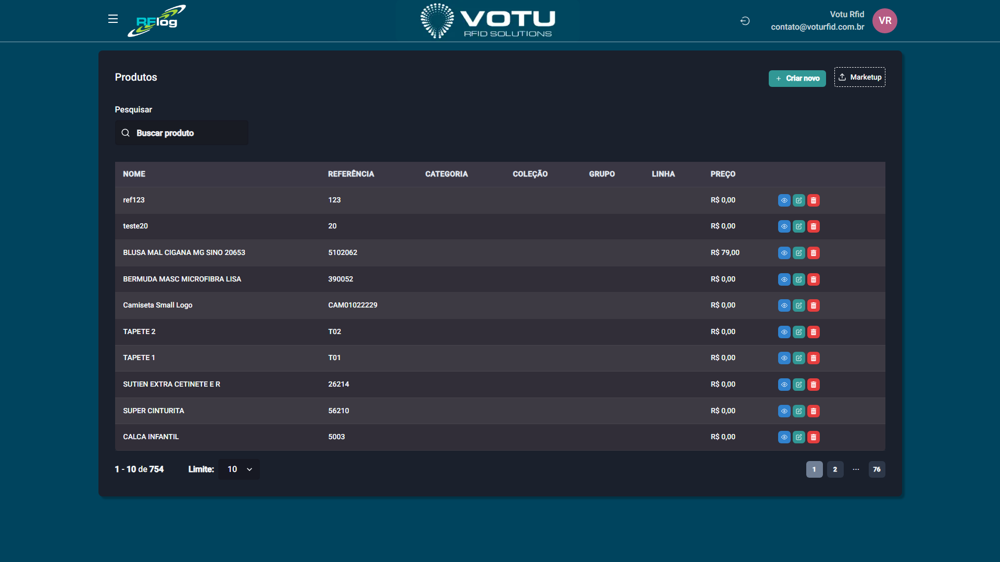

# Produtos

## O que e

A secao **Produtos** permite visualizar e gerenciar o catalogo de produtos do sistema. Via de regra, os produtos sao **sincronizados automaticamente do ERP** do cliente, entao todas as informacoes de cadastro sao puxadas diretamente. Quando nao ha integracao, o usuario pode criar produtos manualmente.

## Como Acessar

Menu lateral: **Produtos** > **Produto**

## Captura de Tela

## O que Voce Ve

A pagina exibe uma tabela com os produtos cadastrados:

| Coluna | Descricao |
|---|---|
| **Nome** | Nome/descricao do produto |
| **Referencia** | Codigo de referencia do produto |
| **Categoria** | Categoria do produto |
| **Colecao** | Colecao a que pertence |
| **Grupo** | Grupo do produto |
| **Linha** | Linha do produto |
| **Preco** | Valor do produto |

## Funcionalidades Disponiveis

### Pesquisar Produtos

Use o campo **"Pesquisar"** no topo da pagina para buscar por nome, referencia ou outros criterios.

### Criar Novo Produto

Clique no botao **"Criar novo"** (canto superior direito) para adicionar um produto manualmente. Esta opcao esta disponivel quando nao ha integracao com ERP ou quando o cliente permite criacao manual.

### Navegacao entre Paginas

Use a paginacao na parte inferior para navegar entre os produtos. Escolha quantos registros exibir por pagina: 10, 50, 100 ou 200.

## Sub-secoes de Produtos

O grupo **Produtos** no menu lateral contem as seguintes sub-secoes:

| Sub-secao | Funcao |
|---|---|
| **[Produtos](Produtos.md)** | Lista de todos os produtos cadastrados |
| **[Linha do Tempo](Linha_do_Tempo.md)** | Rastreabilidade de cada etiqueta RFID (EPC) |
| **[Categorias](Categorias.md)** | Classificacoes por categoria |
| **[Colecoes](Colecoes.md)** | Classificacoes temporais/sazonais |
| **[Grupos](Grupos.md)** | Classificacoes por grupo |
| **[Linhas](Linhas.md)** | Sub-classificacoes por linha |

## Dicas

- Os campos de classificacao (categoria, colecao, grupo, linha) sao puxados do ERP quando ha integracao
- Use a **[Linha do Tempo](Linha_do_Tempo.md)** para rastrear um produto especifico pelo seu EPC
- O botao **Marketup** na lista de produtos permite acessos rapidos dependendo da configuracao

## Veja Tambem

- [Linha do Tempo](Linha_do_Tempo.md) — Rastreabilidade de EPCs
- [Categorias](Categorias.md) — Gerenciar categorias
- [Colecoes](Colecoes.md) — Gerenciar colecoes
- [Grupos](Grupos.md) — Gerenciar grupos
- [Linhas](Linhas.md) — Gerenciar linhas
- [Impressao Imprimir](Impressao_Imprimir.md) — Imprimir etiquetas para produtos

---

*Guia de Usuario RFLog — Votu RFID Solutions*
