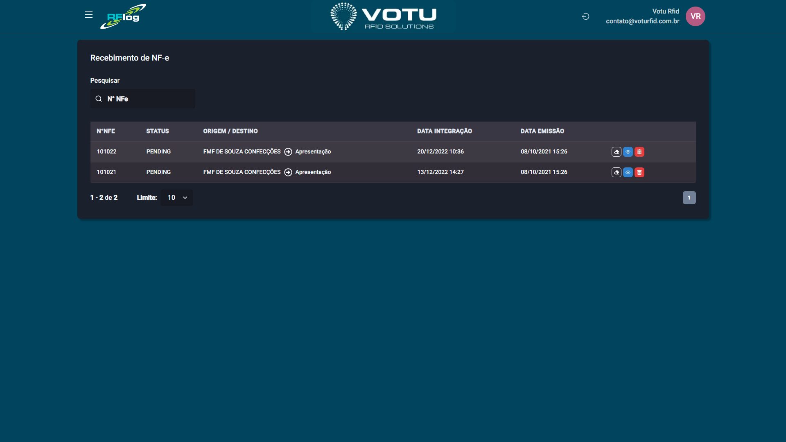

# Recebimento de NF-e

## O que e

O **Recebimento de NF-e** permite integrar e receber Notas Fiscais eletronicas associando aos produtos RFID.

> **Nota:** Esta funcionalidade ainda nao esta em uso ativo.

## Captura de Tela

## Como Acessar

Menu lateral: **Transferencias** > **Recebimento NF-e**

## O que e Exibido

Uma tabela com as notas fiscais recebidas:

| Coluna | Descricao |
|---|---|
| **N NFe** | Numero da Nota Fiscal eletronica |
| **Status** | Status da integracao (ex: PENDING) |
| **Origem / Destino** | Emitente e destinatario |
| **Data Integracao** | Quando foi integrada ao RFLog |
| **Data Emissao** | Quando foi emitida |

## Veja Tambem

- [Transferencias Movimentacao](Transferencias_Movimentacao.md) — Movimentacoes de produtos
- [Sincronia ERP](Sincronia_ERP.md) — Sincronizacao com ERP

---

*Guia de Usuario RFLog — Votu RFID Solutions*
