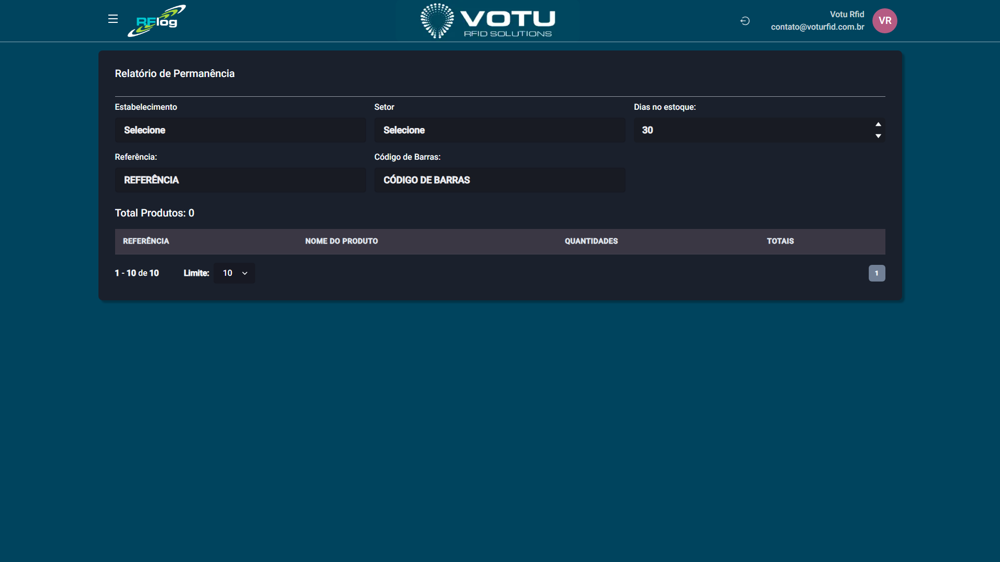

# Relatorio de Permanencia

## O que e

A secao **Relatorio de Permanencia** mostra a "idade" dos produtos em determinado estabelecimento, permitindo identificar produtos parados ha muito tempo no estoque.

## Captura de Tela

## Como Acessar

Menu lateral: **Relatorio** > **Permanencia**

## O que Voce Ve

A pagina exibe os seguintes elementos:

- **Filtros** para refinar a consulta:
  - Estabelecimento
  - Setor
  - Dias no estoque (verifica se produto esta ha tempo igual ou maior que o informado)
  - Referencia
  - Codigo de Barras
- Contador "Total Produtos"
- Tabela com as seguintes colunas:
  - REFERENCIA
  - NOME DO PRODUTO
  - QUANTIDADES
  - TOTAIS
- Possibilidade de abrir a linha do tempo de cada EPC clicando nas quantidades

## Funcionalidade

Ferramenta de **aging** — mostra a "idade" dos produtos em determinado estabelecimento. O usuario preenche o campo "Dias no estoque" para saber se ha produtos (com base nos filtros preenchidos) que estao ha tempo igual ou maior que o valor informado.

No futuro, a secao Relatorio deve agrupar tipos diferentes de relatorios.

## Dicas

- Use os filtros para refinar a busca por estabelecimento, setor ou periodo específico
- O relatorio ajuda a identificar produtos parados que podem precisar de promocao ou revisao de estoque
- Cada quantidade na tabela e clicavel, abrindo um modal com a Linha do Tempo dos EPCs daquele produto

## Veja Tambem

- [Linha do Tempo](Linha_do_Tempo.md) — Rastreabilidade de EPCs
- [Inventarios](Inventarios.md) — Contagem de estoque
- [Estoque](Estoque.md) — Consulta atual de estoque
- [Estabelecimentos Lista](Estabelecimentos_Lista.md) — Lista de estabelecimentos

---
*Guia de Usuario RFLog — Votu RFID Solutions*