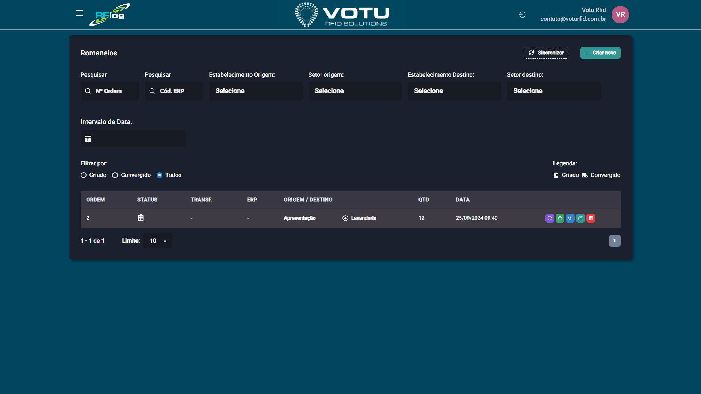

# Romaneios

## O que e

**Romaneios** sao listas de remessa que organizam transferencias em lote. Voce cria um romaneio com os produtos esperados e depois confronta com uma leitura (por codigo de barras, sem EPCs individuais).

## Captura de Tela

## Como Acessar

Menu lateral: **Transferencias** > **Romaneios**

## Criar um Romaneio

1. Clique em **"Criar novo"**
2. Preencha os dados dos **estabelecimentos** envolvidos (origem e destino)
3. Adicione produtos selecionando **Referencia**, **Cor**, **Tamanho** e **Quantidade**
4. Clique em **Salvar**

### Sincronizar com ERP

Se ha integracao com ERP, clique em **"Sincronizar"**, insira o codigo do romaneio e selecione o tipo:
- **Transferencia comum** (Entrada e Saida)
- **Apenas Entrada** (Instantanea)

## Filtros Disponiveis

| Filtro | Descricao |
|---|---|
| **N Romaneio** | Busca por numero |
| **Cod. ERP** | Codigo do romaneio sincronizado com ERP |
| **Estab. Origem / Setor Origem** | Local de saida |
| **Estab. Destino / Setor Destino** | Local de chegada |
| **Intervalo de Data** | Periodo |
| **Status** | Criado, Convergido, Todos |

## Botoes de Acao por Status

### Criado (aguardando movimentacao)

| Botao | Cor | Funcao |
|---|---|---|
| **Criar transferencia** | Roxo | Direciona para tela de movimentacao com dados preenchidos |
| **Criar ordem de impressao** | Laranja | Cria ordem de impressao dos produtos e direciona para [Impressao Imprimir](Impressao_Imprimir.md) |
| **Visualizar** | Azul | Abre detalhes do romaneio |
| **Editar** | Verde | Permite editar dados e adicionar/remover produtos |
| **Deletar** | Vermelho | Deleta o romaneio |

### Convergido (movimentacoes criadas)

| Botao | Cor | Funcao |
|---|---|---|
| **Visualizar** | Azul | Detalhes do romaneio |
| **Deletar** | Vermelho | Deleta o romaneio |

> Quando um romaneio converge, a coluna **TRANSF.** na tabela e preenchida com o numero da transferencia.

## Como Funciona o Confronto

Ao criar a transferencia a partir de um romaneio, o sistema confronta os **codigos de barras dos EPCs lidos** com os **codigos de barras e quantidades** esperados no romaneio. E um confronto por quantidade, nao por EPC individual.

## Dicas

- Use romaneios quando precisar organizar transferencias com muitos produtos
- A criacao de ordem de impressao a partir do romaneio agiliza quando as etiquetas ainda nao foram impressas
- O romaneio convergido gera automaticamente uma transferencia na lista de movimentacoes

## Veja Tambem

- [Transferencias Movimentacao](Transferencias_Movimentacao.md) — Lista de movimentacoes
- [Transferencias Entrada Saida](Transferencias_Entrada_Saida.md) — Criar transferencia
- [Vendas Pedidos](Vendas_Pedidos.md) — Funciona com logica semelhante (pedidos de venda)

---

*Guia de Usuario RFLog — Votu RFID Solutions*
