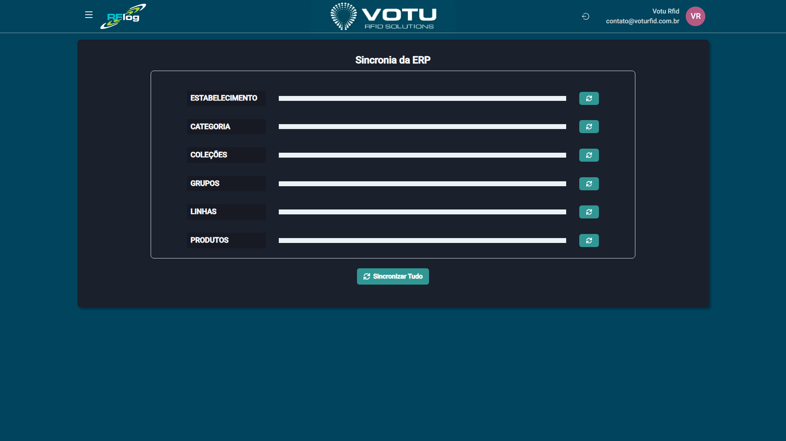

# Sincronia ERP

## O que e

A secao **Sincronia ERP** permite sincronizar dados entre o RFLog e o ERP do cliente. Via de regra, os dados (produtos, categorias, colecoes, grupos, linhas, estabelecimentos) sao puxados do ERP do cliente. Dependendo do tipo de integracao, inventarios, transferencias e vendas podem enviar dados de volta ao ERP.

## Captura de Tela

## Como Acessar

Menu lateral: **Sincronia ERP** > **Sincronia**

## O que Voce Ve

A pagina exibe os seguintes elementos:

- **Botoes de sincronizacao por entidade**:
  - ESTABELECIMENTO
  - CATEGORIA
  - COLECOES
  - GRUPOS
  - LINHAS
  - PRODUTOS
- Botao **"Sincronizar Tudo"** para sincronizar todas de uma vez

## Funcionalidade

Sincronizacao de dados entre o RFLog e o ERP. Permite sincronizar individualmente cada tipo de entidade ou tudo de uma vez. Via de regra, os dados (produtos, categorias, colecoes, grupos, linhas, estabelecimentos) sao puxados do ERP do cliente. Dependendo do tipo de integracao, inventarios, transferencias e vendas podem enviar dados de volta ao ERP.

## Dicas

- Use a sincronizacao individual quando precisar atualizar apenas um tipo de dado especifico
- Use "Sincronizar Tudo" para atualizar todos os dados de uma vez
- Verifique os logs de sincronizacao para garantir que o processo ocorreu corretamente
- Em caso de erro, verifique a conectividade com o ERP e as permissoes de acesso

## Veja Tambem

- [Estabelecimentos Lista](Estabelecimentos_Lista.md) — Gestao de estabelecimentos
- [Categorias](Categorias.md) — Classificacoes por categoria
- [Colecoes](Colecoes.md) — Classificacoes temporais/sazonais
- [Grupos](Grupos.md) — Classificacoes por grupo
- [Linhas](Linhas.md) — Sub-classificacoes por linha
- [Produtos](Produtos.md) — Catalogo de produtos

---
*Guia de Usuario RFLog — Votu RFID Solutions*