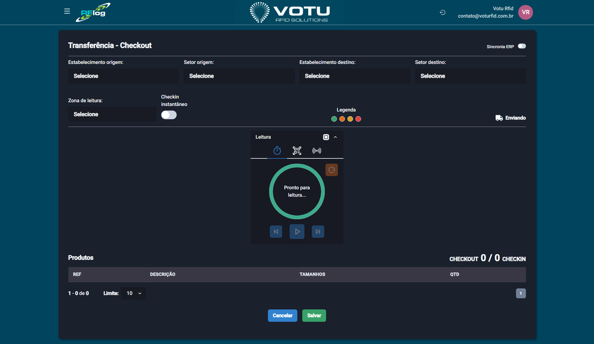

# Transferencias — Entrada e Saida (Checkout/Checkin)

## O que e

A tela de **Entrada e Saida** e onde voce cria as movimentacoes de produtos entre estabelecimentos e setores. Ela conduz o processo de **checkout** (saida) e **checkin** (entrada) via leitura RFID.

## Captura de Tela

## Como Acessar

Menu lateral: **Transferencias** > **Entrada e Saida**

## Como Criar uma Movimentacao

### Passo 1: Selecionar Origem e Destino

1. Selecione o **Estabelecimento origem**
2. Selecione o **Setor origem** (opcional)
3. Selecione o **Estabelecimento destino**
4. Selecione o **Setor destino** (opcional)
5. Selecione a **Zona de leitura** (cabine)

> **Checkin Instantaneo:** Dependendo da configuracao do cliente, pode aparecer um toggle de **Checkin instantaneo**. Se ativado, a leitura ja da checkin automatico no destino (semelhante a [Transferencias Instantanea](Transferencias_Instantanea.md)).

### Passo 2: Realizar a Leitura

1. Inicie a captura (leitura automatica de 5 segundos ou modo play/pause)
2. Os produtos lidos sao exibidos em uma grade com REF, DESCRICAO, TAMANHOS e QTD
3. Clique nas **quantidades** na grade para abrir o modal da [Linha do Tempo](Linha_do_Tempo.md) dos EPCs lidos

### Passo 3: Finalizar

- **Cancelar** — Volta para a tela de movimentacoes sem salvar
- **Salvar** — Cria a movimentacao e volta para [Transferencias Movimentacao](Transferencias_Movimentacao.md)

## Modos de Leitura

| Modo | Descricao |
|---|---|
| **5 segundos** | Leitura automatica que para apos 5 segundos (padrao) |
| **Play/Pause** | A leitura continua ate o usuario clicar novamente para parar |

## Dicas

- Os setores sao opcionais — se nao selecionados, a movimentacao e feita apenas entre estabelecimentos
- Clique nas quantidades para ver a linha do tempo dos EPCs
- Se o cliente tiver integracao com ERP, a movimentacao pode ser sincronizada automaticamente

## Veja Tambem

- [Transferencias Movimentacao](Transferencias_Movimentacao.md) — Lista de movimentacoes
- [Transferencias Instantanea](Transferencias_Instantanea.md) — Checkin automatico
- [Linha do Tempo](Linha_do_Tempo.md) — Rastreabilidade de EPCs
- [Romaneios](Romaneios.md) — Criar movimentacoes a partir de romaneios

---

*Guia de Usuario RFLog — Votu RFID Solutions*
