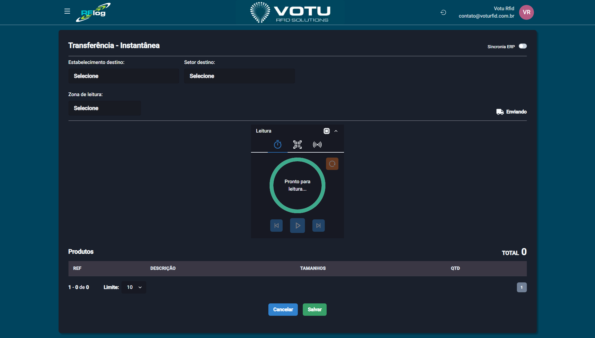

# Transferencias — Instantanea (Checkin Automatico)

## O que e

A **Transferencia Instantanea** permite mover produtos diretamente para o destino com uma unica leitura. Diferente do checkout/checkin tradicional, aqui **nao ha separacao entre saida e entrada** — a leitura ja da checkin automatico no destino.

## Captura de Tela

## Como Acessar

Menu lateral: **Transferencias** > **Instantanea**

## Como Usar

### Passo 1: Selecionar Destino

1. Selecione o **Estabelecimento destino**
2. Selecione o **Setor destino** (opcional)
3. Selecione a **Zona de leitura**

### Passo 2: Realizar a Leitura

1. Inicie a captura (5 segundos ou play/pause)
2. Os produtos lidos aparecem na grade com quantidades
3. Clique nas quantidades para acessar a [Linha do Tempo](Linha_do_Tempo.md) dos EPCs

### Passo 3: Finalizar

- **Cancelar** — Volta para a tela de movimentacoes sem salvar
- **Salvar** — Concretiza a movimentacao com checkin automatico

## Diferenca entre Instantanea e Checkout/Checkin

| Caracteristica | Checkout/Checkin | Instantanea |
|---|---|---|
| **Etapas** | Duas (saida + entrada) | Uma (leitura direta) |
| **Origem** | Selecionada pelo usuario | Nao informada (sistema identifica) |
| **Checkin** | Manual (na tela de movimentacao) | Automatico (na propria leitura) |
| **Ideal para** | Transferencias controladas | Movimentacoes rapidas |

## Quando Usar

- Quando precisa mover produtos rapidamente sem etapa de checkout
- Quando a origem ja esta clara pelo contexto (ex: todos os produtos lidos pertencem a um unico local)
- Para movimentacoes simples que nao exigem controle de saida separado

## Veja Tambem

- [Transferencias Movimentacao](Transferencias_Movimentacao.md) — Lista de movimentacoes
- [Transferencias Entrada Saida](Transferencias_Entrada_Saida.md) — Checkout/Checkin tradicional
- [Linha do Tempo](Linha_do_Tempo.md) — Rastreabilidade de EPCs

---

*Guia de Usuario RFLog — Votu RFID Solutions*
