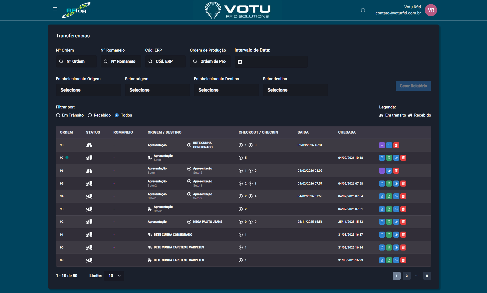

# Transferencias — Movimentacao

## O que e

A **Movimentacao** e a tela que agrupa todas as transferencias de produtos entre estabelecimentos e setores. E uma das principais funcionalidades do RFLog, responsavel pelo rastreamento de produtos em transito.

## Como Acessar

Menu lateral: **Transferencias** > **Movimentacao**

## Captura de Tela

## Filtros Disponiveis

| Filtro | Descricao |
|---|---|
| **N Ordem** | Numero de ordem da movimentacao |
| **N Romaneio** | Numero do romaneio vinculado |
| **Cod. ERP** | Codigo devolvido pelo ERP |
| **Ordem de Producao** | Filtra por OP das etiquetas envolvidas |
| **Intervalo de Data** | Periodo da movimentacao |
| **Estab. Origem / Setor Origem** | Local de saida |
| **Estab. Destino / Setor Destino** | Local de chegada |

### Filtros Rapidos por Status

- **Em Transito** — Pecas enviadas, aguardando check-in
- **Recebido** — Pecas ja recebidas no destino
- **Todos** — Sem filtro

## Botoes de Acao por Status

### Em Transito

| Botao | Cor | Funcao |
|---|---|---|
| **Realizar Check-In** | Roxo | Abre tela de leitura para dar entrada. Campos de origem/destino ficam travados. Legenda de cores: **Amarelo** = nao lido, **Verde** = match, **Laranja** = a mais, **Vermelho** = nao esperado |
| **Visualizar** | Azul | Abre detalhes da movimentacao |
| **Deletar** | Vermelho | Deleta e "volta" as pecas para o estoque anterior |

> **Check-In:** Selecione a zona de leitura e inicie a captura (5 segundos ou play/pause). Os itens nao lidos ficam amarelos, os encontrados ficam verdes, itens a mais ficam laranjas e itens nao esperados ficam vermelhos.

### Recebido

| Botao | Cor | Funcao |
|---|---|---|
| **Relatorio de Transferencia** | Azul | Emite relatorio da movimentacao |
| **Arquivo.txt** | Verde | Exporta dados dos produtos |
| **Visualizar** | Azul | Detalhes da movimentacao |
| **Deletar** | Vermelho | Deleta a movimentacao |

## Informacoes Adicionais

- **Icone verde** ao lado do N Ordem — indica que a transferencia e [Transferencias Instantanea](Transferencias_Instantanea.md) e todos os itens pertencem a mesma ordem de producao
- **Informacao ao lado do Status** — codigo de check-in ou check-out vindo do ERP (quando ha integracao)

## Como Funciona o Estoque durante Transferencias

Quando pecas sao enviadas (checkout), elas saem do estoque de origem e ficam em **"limbo"** — nao pertencem a origem nem ao destino ate o check-in ser realizado. Ao deletar uma movimentacao, as pecas voltam ao estoque anterior.

## Gerar Relatorio

Use o botao **"Gerar Relatorio"** (azul) para emitir um relatorio com base nos filtros. Oferece agrupamento por Ordem de Transferencia.

## Dicas

- Use os filtros avancados para encontrar movimentacoes especificas
- O check-in pode ser feito selecionando a zona de leitura adequada
- A legenda de cores no check-in ajuda a identificar discrepancas rapidamente

## Veja Tambem

- [Transferencias Entrada Saida](Transferencias_Entrada_Saida.md) — Criar movimentacao (checkout/checkin)
- [Transferencias Instantanea](Transferencias_Instantanea.md) — Checkin automatico
- [Romaneios](Romaneios.md) — Listas de remessa para organizacao
- [Estoque](Estoque.md) — Consulta de estoque atual

---

*Guia de Usuario RFLog — Votu RFID Solutions*
