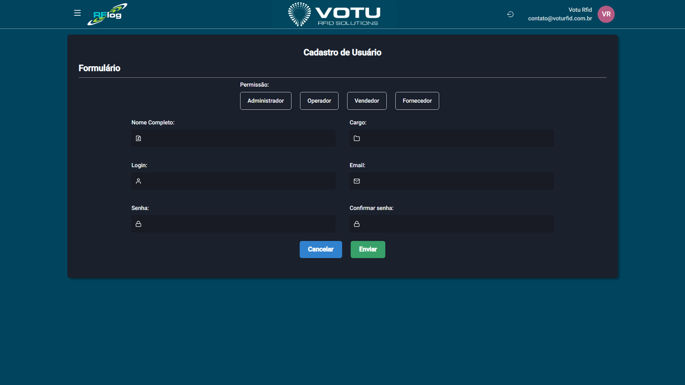

# Usuarios - Cadastro

## O que e

A secao **Usuarios - Cadastro** permite criar novos usuarios com definicao de permissoes de acesso.

## Captura de Tela

## Como Acessar

Menu lateral: **Usuarios** > **Cadastro**

## O que Voce Ve

A pagina exibe um formulario com os seguintes campos:

- **Permissao** (dropdown): Administrador | Operador | Vendedor | Fornecedor
- **Nome Completo**
- **Cargo**
- **Login**
- **Email**
- **Senha**

Botoes: **Cancelar**, **Enviar**

## Funcionalidade

Formulario de criacao de novos usuarios com definicao de permissoes de acesso. Somente usuarios com perfil Administrador podem criar outros usuarios.

## Dicas

- Atribua a permissao correta conforme a responsabilidade do usuario (Administrador tem acesso total, Operador realiza operacoes basicas, Vendedor consulta somente suas vendas, Fornecedor cria ordens de impressao)
- Use um email valido para notificacoes e recuperacao de senha
- Após o cadastro, o usuario aparecera na lista de usuarios para consulta edicao ou exclusao (por administradores)

## Veja Tambem

- [Usuarios Lista](Usuarios_Lista.md) — Lista de usuarios cadastrados
- [Tipos de Usuario](Tipos de Usuario) — Detalhes dos perfis e permissoes
- [Estabelecimentos Lista](Estabelecimentos_Lista.md) — Gestao de estabelecimentos
- [Sincronia ERP](Sincronia_ERP.md) — Sincronizacao de dados com o ERP

---
*Guia de Usuario RFLog — Votu RFID Solutions*