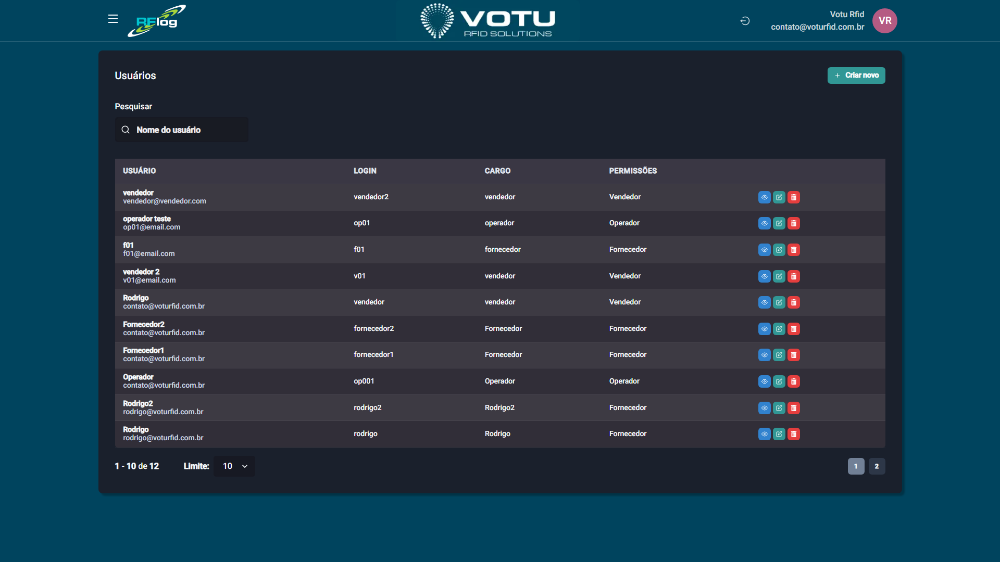

# Usuarios - Lista

## O que e

A secao **Usuarios** permite visualizar e gerenciar os usuarios do sistema com seus cargos e permissoes.

## Captura de Tela

## Como Acessar

Menu lateral: **Usuarios** > **Lista**

## O que Voce Ve

A pagina exibe uma tabela com os usuarios cadastrados:

| Coluna | Descricao |
|---|---|
| **USUARIO** | Nome do usuario |
| **LOGIN** | Login para acesso ao sistema |
| **CARGO** | Cargo/funcao do usuario |
| **PERMISSOES** | Nivel de acesso (Administrador, Operador, Vendedor, Fornecedor) |

Além disso, há:
- Botao **"Criar novo"** para adicionar um novo usuario
- Campo de busca **"Pesquisar"** para filtrar por nome, login, cargo ou permissoes

## Funcionalidade

Gestao de usuarios do sistema com cargos e permissoes. Os botoes de acao em cada tela variam de acordo com o tipo de usuario (ver seção Tipos de Usuario).

## Dicas

- Use o campo de busca para localizar rapidamente um usuario especifico
- Atribua permissoes adequadas conforme a responsabilidade de cada usuario
- Somente usuarios com perfil Administrador podem criar outros usuarios

## Veja Tambem

- [Usuarios Cadastro](Usuarios_Cadastro.md) — Formulario de criacao/edicao de usuarios
- [Estabelecimentos Lista](Estabelecimentos_Lista.md) — Gestao de estabelecimentos
- [Sincronia ERP](Sincronia_ERP.md) — Sincronizacao de dados com o ERP
- [Tipos de Usuario](Tipos_Usuarios.md) — Detalhes dos perfis e permissoes

---
*Guia de Usuario RFLog — Votu RFID Solutions*