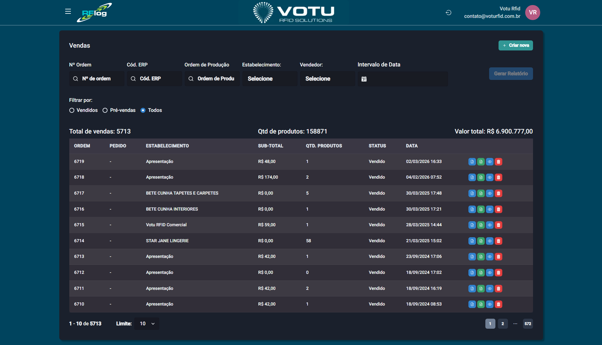

# Vendas — Lista de Vendas

## O que e

A secao de **Vendas** registra movimentacoes de saida de produtos, tirando-os dos estoques e informando ao ERP (quando ha integracao). A venda e feita por **leitura das pecas em cabine ou zona de leitura** (leitor PDV, por exemplo).

## Captura de Tela

## Como Acessar

Menu lateral: **Vendas** > **Lista de vendas**

## Como Criar uma Venda

1. Clique em **"Criar nova"** (canto superior direito)
2. Selecione o **Estabelecimento** (para registro da venda), o **Vendedor** e a **Zona de leitura**
3. Realize a leitura das pecas (5 segundos ou play/pause)
4. Voce vera as quantidades e valores (se houver preco no cadastro)
5. Escolha como salvar:
   - **Venda** — Acao final. Os produtos saem do estoque com status de vendido
   - **Pre-venda** — Salva como rascunho, podendo ser editada ou transformada em venda posteriormente

## Filtros Disponiveis

| Filtro | Descricao |
|---|---|
| **N Ordem** | Numero de controle do RFLog |
| **Cod. ERP** | Codigo devolvido pelo ERP |
| **Ordem de Producao** | Filtra por OP |
| **Estabelecimento** | Filtra por local |
| **Vendedor** | Filtra por vendedor |
| **Intervalo de Data** | Periodo |
| **Status** | Vendidos, Pre-vendas, Todos |

## Metricas Gerais

A tela mostra metricas consolidadas:
- **Total de vendas**
- **Quantidade de produtos vendidos**
- **Valor total**

## Botoes de Acao por Status

### Vendidos

| Botao | Cor | Funcao |
|---|---|---|
| **Relatorio da Venda** | Azul | Emite relatorio com dados da venda |
| **Arquivo.txt** | Verde | Exporta arquivo com codigo_barras e quantidade |
| **Visualizar** | Azul | Detalhes da venda |
| **Deletar** | Vermelho | Deleta a venda |

### Pre-vendas

| Botao | Cor | Funcao |
|---|---|---|
| **Arquivo.txt** | Verde | Exporta dados dos produtos |
| **Visualizar** | Azul | Detalhes da pre-venda |
| **Realizar venda** | Roxo | Abre opcoes para converter em venda (veja abaixo) |
| **Deletar** | Vermelho | Deleta a pre-venda |

### Opcoes de "Realizar Venda"

Ao clicar em **"Realizar venda"** em uma pre-venda, voce escolhe:

| Opcao | Descricao |
|---|---|
| **Vender SEM LEITURA** | Converte direto em venda, sem confirmacao |
| **Vender COM LEITURA** | Redireciona para tela de leitura esperando as mesmas pecas da pre-venda |
| **Editar pre-venda** | Tela de leitura com itens carregados; permite adicionar ou remover pecas antes de converter |

## Dicas

- A pre-venda funciona como um "orcamento" — pode ser editada antes de concretizar
- Use **Vender COM LEITURA** para garantir que as pecas estao presentes no momento da venda
- O valor das vendas depende do preco cadastrado nos produtos

## Veja Tambem

- [Vendas Pedidos](Vendas_Pedidos.md) — Pedidos de venda (pre-confronto)
- [Estoque](Estoque.md) — O estoque e atualizado ao vender
- [Sincronia ERP](Sincronia_ERP.md) — Sincronizacao de vendas com ERP

---

*Guia de Usuario RFLog — Votu RFID Solutions*
