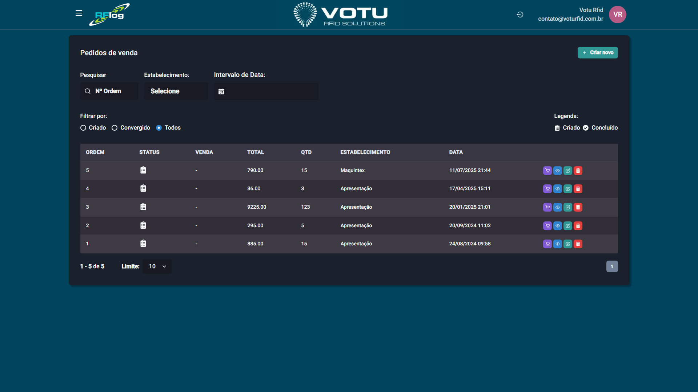

# Vendas — Pedidos

## O que e

Os **Pedidos de Venda** permitem criar pedidos que posteriormente sao transformados em vendas via leitura e conferencia. Funciona de forma semelhante a [Romaneios](Romaneios.md), mas para o contexto de vendas.

## Captura de Tela

## Como Acessar

Menu lateral: **Vendas** > **Pedidos**

## Criar um Pedido

1. Clique em **"Criar novo"** (canto superior direito)
2. Selecione o **Estabelecimento**
3. Adicione produtos por **Referencia**, **Cor**, **Tamanho** e **Quantidade**
4. Clique em **Salvar** ou **Cancelar**

## Filtros Disponiveis

| Filtro | Descricao |
|---|---|
| **N Pedido** | Numero de controle do RFLog |
| **Estabelecimento** | Filtra por local |
| **Intervalo de Data** | Periodo |
| **Status** | Criado, Convergido, Todos |

## Botoes de Acao por Status

### Criado

| Botao | Cor | Funcao |
|---|---|---|
| **Criar venda** | Roxo | Abre tela de leitura com quantidade esperada. O sistema confronta codigos de barras dos EPCs lidos com os do pedido |
| **Visualizar** | Azul | Detalhes do pedido |
| **Editar** | Verde | Adicionar ou remover produtos do pedido |
| **Deletar** | Vermelho | Deleta o pedido |

### Convergido

| Botao | Cor | Funcao |
|---|---|---|
| **Visualizar** | Azul | Detalhes do pedido convergido (coluna VENDA preenchida) |
| **Deletar** | Vermelho | Deleta o pedido convergido |

## Como Funciona o Confronto

Ao clicar em **"Criar venda"**, o sistema confronta os **codigos de barras dos EPCs lidos** com os **codigos de barras dos produtos do pedido**. Para o usuario, a experiencia e a mesma das outras telas de leitura — o que importa e se o que foi lido bate com o esperado.

## Dicas

- Use pedidos quando quiser planejar vendas antes de concretiza-las
- O confronto e por codigo de barras, nao por EPC individual
- O pedido convergido ganha o numero da venda na coluna VENDA

## Veja Tambem

- [Vendas Lista](Vendas_Lista.md) — Lista de vendas
- [Romaneios](Romaneios.md) — Logica semelhante para transferencias
- [Transferencias Entrada Saida](Transferencias_Entrada_Saida.md) — Telas de leitura similares

---

*Guia de Usuario RFLog — Votu RFID Solutions*
